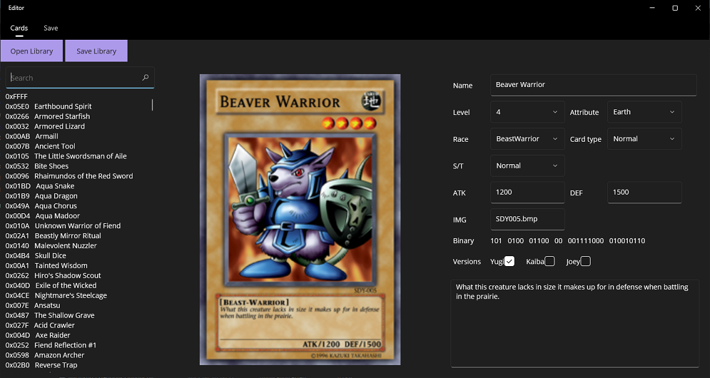

# YGO-PoC Toolset

A collection of tools for modding Yu-Gi-Oh! Power of Chaos - Joey the Passion.
> **Note**
> This toolset was made specifically for the "No-CD/Fixed" version of the game's executable.

Projects:

* Unpacker
	* Allows you to unpack and decompress the game's resource files (e.g. data.dat)
	* Having the unpacked library in your game's directory, will make the game load the resources from there, instead of the packed binary
	* Usage: simply drag the packed binary into Unpacker.exe
* PocTools
	* This class library contains tools for handling unpacked libraries and decrypting/editing/re-encrypting save files (system.dat)
* Editor
	* A .NET MAUI client for PoCTools
	* Allows you to view the cards (including unused ones) and edit their values (names, descriptions, properties etc.)
	* Allows you to view your card collection, and edit how many copies of each card you have (no registry editing needed)
   	
	
* PoCModLoader
	* A simple mod loader that allows you to load custom DLL mods
	* Usage: copy the contents of "ModLoader" into the game's directory, then put your custom DLL mods into the "mods" folder, and your script JSON files into the "scripts" folder
* Mods
	* Here you can find DLL mods, which you can use as an example, with some utility functions
